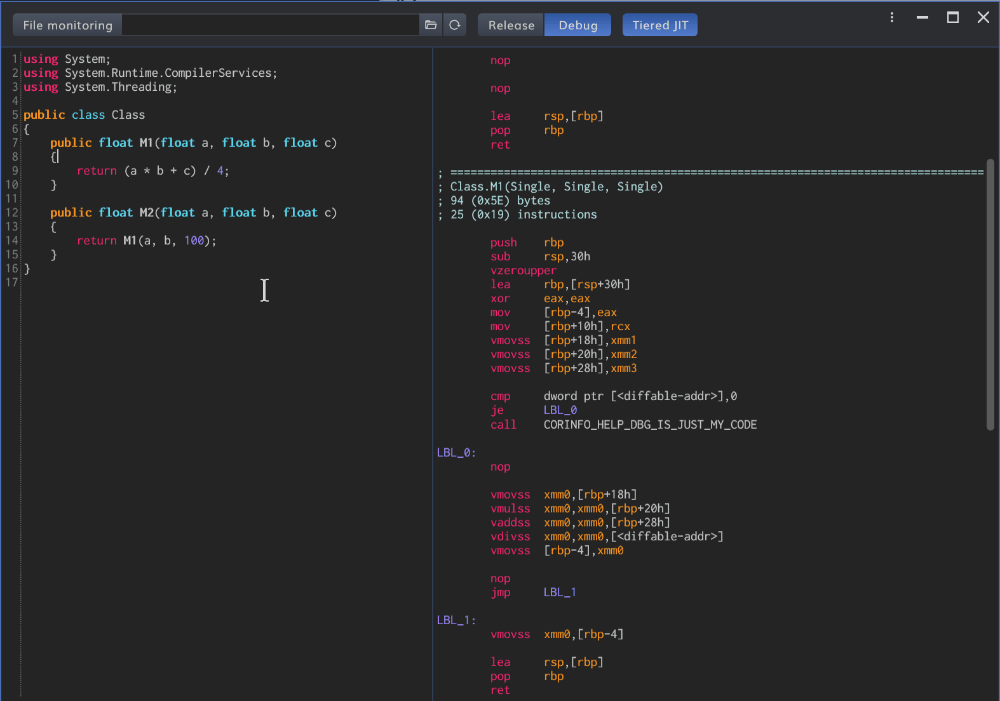

# JitPad

On the fly disassemble C# code based on JitDasm




## Build and Run
```
> git clone --recursive https://github.com/YoshihiroIto/JitPad.git
> cd JitPad
> dotnet build
> JitPad\bin\Debug\netcoreapp3.1\JitPad.exe

or

Open JitPad.sln
```

## Credits

- Disassembler
    - [JitDasm](https://github.com/0xd4d/JitDasm) Disassemble jitted .NET methods

- C# compiler
    - [Roslyn](https://github.com/dotnet/roslyn) The Roslyn .NET compiler provides C# and Visual Basic languages with rich code analysis APIs.

- GUI
    - [Biaui](https://github.com/YoshihiroIto/Biaui) WPF dark theme and controls.
    - [AvalonEdit](https://github.com/icsharpcode/AvalonEdit) The WPF-based text editor component used in SharpDevelop
    - [XamlBehaviors for WPF](https://github.com/Microsoft/XamlBehaviorsWpf) XAML Behaviors is an easy-to-use means of adding common and reusable interactivity to your WPF applications with minimal code. 
    - [RoslynPad](https://github.com/aelij/RoslynPad) A cross-platform C# editor based on Roslyn and AvalonEdit 
    - [Material Design](https://github.com/Templarian/MaterialDesign) ✒4900+ Material Design Icons from the Community

- Test
    - [VSTest](https://github.com/microsoft/vstest/) Visual Studio Test Platform is the runner and engine that powers test explorer and vstest.console.
    - [xUnit.net](https://github.com/xunit/xunit) xUnit.net is a free, open source, community-focused unit testing tool for the .NET Framework.
    - [coverlet.collector](https://github.com/tonerdo/coverlet) Cross platform code coverage for .NET

- Misc
    - [IgnoresAccessChecksToGenerator](https://github.com/aelij/IgnoresAccessChecksToGenerator) Generates reference assemblies where all the internal types & members become public, and applies the IgnoresAccessChecksTo attribute
    - [Windows API Code Pack](https://github.com/contre/Windows-API-Code-Pack-1.1) Windows API Code Pack 1.1
    - [ReactiveProperty](https://github.com/runceel/ReactiveProperty) ReactiveProperty provides MVVM and asynchronous support features under Reactive Extensions.
    - [Reactive Extensions](https://github.com/dotnet/reactive) The Reactive Extensions for .NET


## Author

Yoshihiro Ito  
Twitter: [https://twitter.com/yoiyoi322](https://twitter.com/yoiyoi322)  
Email: yo.i.jewelry.bab@gmail.com  


## License

MIT
